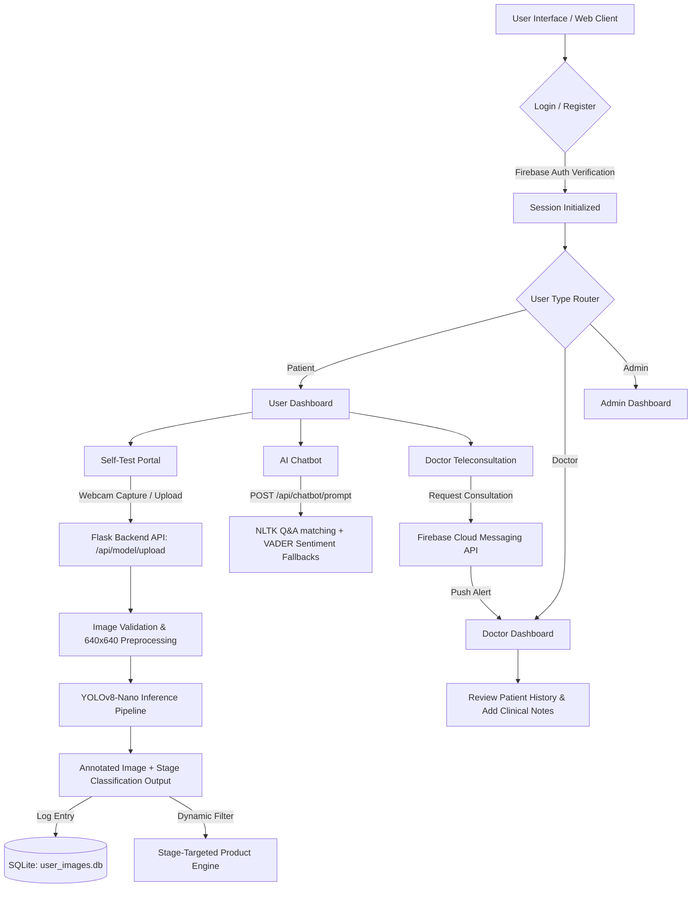
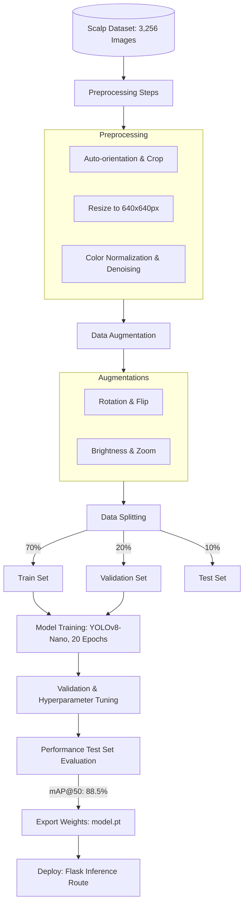

<div align="center">
  <h1>💇‍♂️ ScalpSense</h1>
  <p><strong>AI-Powered Scalp Health Diagnostics & Teleconsultation Platform</strong></p>

  <p>
    An end-to-end, multi-tenant digital healthcare system bridging custom computer vision diagnostics with real-time dermatologist consultations.
  </p>

  <p>
    <a href="https://www.python.org/"></a>
    <a href="https://flask.palletsprojects.com/"></a>
    <a href="https://pytorch.org/"></a>
    <a href="https://www.nltk.org/"></a>
    <a href="https://sqlite.org/"></a>
    <a href="https://firebase.google.com/"></a>
    <a href="https://opensource.org/licenses/MIT"></a>
  </p>
</div>

---

## 📖 Overview

**ScalpSense** bridges the gap between automated scalp diagnostics and professional dermatological care. By combining custom computer vision with sentiment-aware conversational AI, ScalpSense enables users to perform instant scalp analysis, track hair health progression, browse a stage-targeted treatment marketplace, and consult verified doctors in real-time.

---

## ✨ Key Features

- 🔬 **Diagnostics**: Instant scalp stage classification (Normal, Stages 1–3, Bald) via webcam capture or upload with annotated bounding boxes.
- 💬 **Sentiment-Aware Chatbot**: NLTK VADER-powered assistant that gauges user anxiety in real-time and routes fallbacks to professionals.
- 🏥 **Multi-Tenant System**: Tailored workspaces and dashboards for Patients, Doctors, and Administrators.
- 🛍️ **Smart Marketplace**: E-commerce catalog automatically matching treatments/shampoos to the user's hair-loss stage.
- 🔔 **FCM Notification Routing**: Real-time push notifications connecting doctors and patients instantly.

---

## 📸 UI Showcase

| 📱 Patient Dashboard | 📋 Self-Test & Diagnostic History |
| :---: | :---: |
|  |  |
| **🩺 Doctor Workspace Portal** | **👤 Doctor Profile & Credentials Setup** |
|  |  |

---

## 🚀 Quick Start

```bash
git clone https://github.com/yourusername/ScalpSense.git && cd ScalpSense
cp .env.example .env
python wsgi.py
```

<details>
<summary>⚙️ View Detailed Setup & Deployment Instructions</summary>

### 1. Initialize Virtual Environment
```powershell
# Windows
python -m venv venv
.\venv\Scripts\activate

# Linux/macOS
python3 -m venv venv
source venv/bin/activate
```

### 2. Install Dependencies
```bash
pip install -r requirements.txt
```

### 3. Populate Environment Variables
Open the newly created `.env` file and configure:
* `SECRET_KEY`: Secure random string encrypting session data.
* `WEB_API_KEY` & `MOBILE_API_KEY`: Gating keys for route auth.
* Firebase Admin settings (`FB_APIKEY`, `FIREBASE_CRED_PATH`, `FCM_SERVER_KEY`).

### 4. Production Deployment
* **Waitress (Windows)**:
  ```powershell
  waitress-serve --listen=127.0.0.1:5000 wsgi:app
  ```
* **Gunicorn (Linux/macOS)**:
  ```bash
  gunicorn -w 4 -b 127.0.0.1:5000 wsgi:app
  ```
</details>

---

## 🛠️ Tech Stack & Architecture

<details>
<summary>💻 View Technology Stack Details</summary>

| Layer | Technology & Tools |
| :--- | :--- |
| **Frontend** | HTML5, CSS3, Vanilla JavaScript (ES6+) |
| **Backend** | Python 3.10+, Flask 3.0, Gunicorn (POSIX) / Waitress (Windows WSGI) |
| **Database** | SQLite3, Google Cloud Firestore |
| **ML & AI** | PyTorch, Ultralytics YOLOv8 (Inference), NLTK VADER (Sentiment Analysis) |
| **Communications** | Firebase Cloud Messaging (FCM), Firebase Admin SDK |
| **Environment** | Dotenv, Virtualenv, PIP |
</details>

<details>
<summary>⚙️ View System Workflow Flowchart & Architecture Spec</summary>

### System Workflow


### System Architecture
```
┌────────────────────────────────────────────────────────┐
│                      Web/Mobile Client                 │
└───────────────────────────┬────────────────────────────┘
                            │ (JSON / Multipart Form)
                            ▼
┌────────────────────────────────────────────────────────┐
│                   Flask Backend (WSGI)                 │
│  ┌──────────────────────────────────────────────────┐  │
│  │                     Blueprints                   │  │
│  │   User Routes    Doctor Routes    Admin Routes   │  │
│  └────────────────────────┬─────────────────────────┘  │
│                           │                            │
│                           ▼                            │
│  ┌──────────────────────────────────────────────────┐  │
│  │                    API Gateway                   │  │
│  │   - Security Middleware (API Key Gating)         │  │
│  │   - CORS Headers Enforcement                     │  │
│  └───────┬─────────────────┬─────────────────┬──────┘  │
└──────────┼─────────────────┼─────────────────┼─────────┘
           │                 │                 │
           ▼                 ▼                 ▼
┌──────────────────┐ ┌───────────────┐ ┌───────────────┐
│  PyTorch Models  │ │ Firebase SDK  │ │  SQLite DBs   │
│  - YOLOv8-Nano   │ │ - Firestore   │ │ - database.db │
│  - NLTK VADER    │ │ - Messaging   │ │ - user_images │
└──────────────────┘ └───────────────┘ └───────────────┘
```

### Database Specifications
- **`database.db`**: Stores product details (ID, Name, Price, Brand, Stage Category, URL, Benefits) for the marketplace.
- **`user_images.db`**: Stores patient scanning logs (ID, User ID, Base64 Image, Scan Timestamp, Predicted Stage).

### Security Gating
A unified API-key validation middleware (`api_bp.before_request`) inspects query parameters on incoming requests to authorize internal and external clients:
- `WEB_API_KEY`: Gates internal requests from the web frontend blueprints.
- `MOBILE_API_KEY`: Gates external requests generated by the Flutter mobile application.
</details>

---

## 📊 Model Details

<details>
<summary>🧠 View Performance Metrics & Dataset Preprocessing Pipeline</summary>

### Performance Metrics
| Metric | Value | Detail |
| :--- | :--- | :--- |
| **mAP@50** | **88.5%** | Mean Average Precision showing strong object localization stability. |
| **Precision** | **90.0%** | Minimal false positive classification rate. |
| **Recall** | **87.0%** | Low false negative rate for hair thinning identification. |
| **Inference Latency** | **1.6 seconds** | Measured on CPU (includes model load, preprocessing, inference, and database logging). |

### Model Architecture: YOLOv8-Nano
Designed for low latency, YOLOv8-Nano balances high speed with local model execution, containing **225 layers, 3.01 million parameters, and 8.2 GFLOPs**.



### Dataset and Preprocessing
The model was trained on a custom-curated collection of **3,256 high-resolution scalp images**:
* **Classes**: Normal, Stage 1, Stage 2, Stage 3, and Bald.
* **Preprocessing**: Images resized to $640 \times 640$ pixels, normalized and denoised.
* **Data Augmentations**: Applied rotation, vertical/horizontal flipping, zoom, and brightness adjustments.
* **Split**: 70% Training, 20% Validation, 10% Testing.
* **Duration**: 20 epochs using PyTorch.
</details>

---

## 🔌 API & Project Docs

<details>
<summary>📄 View Full REST API Endpoint Catalog</summary>

All requests must supply a valid `api_key` query parameter matching either the `WEB_API_KEY` or `MOBILE_API_KEY`.

### 1. Model & Diagnostics
* **Upload Image** (`POST /api/model/upload?api_key=<KEY>&user_id=<USER_ID>`)
  * **Payload**: `multipart/form-data` containing the image file under the key `image`.
  * **Response**: `{"message": "File uploaded successfully", "filename": "<user_id>.png"}`
* **Predict Stage** (`GET /api/model/predict?api_key=<KEY>&user_id=<USER_ID>`)
  * **Action**: Invokes YOLOv8-Nano, runs inference on the uploaded image, annotates it, and logs the result.
  * **Response**: `{"stage": "stage 2", "file": "<Base64 Encoded Image Data>"}`

### 2. Conversational Agent
* **Chatbot Prompt** (`POST /api/chatbot/prompt?api_key=<KEY>`)
  * **Payload**: `{"prompt": "my hair is falling out what should I do?"}`
  * **Response**: `{"response": "Based on your queries, I recommend checking..."}`
* **Sentiment Analysis** (`POST /api/techfiesta/prompt?api_key=<KEY>`)
  * **Payload**: `{"sentence": "I feel extremely anxious about my baldness"}`
  * **Response**: `{"score": {"neg": 0.53, "neu": 0.47, "pos": 0.0, "compound": -0.52}}`

### 3. Database & Products
* **Get All Products** (`GET /api/database/products?api_key=<KEY>`)
  * **Response**: JSON array containing all catalog products.
* **Get Specific Product** (`GET /api/database/product/<id>?api_key=<KEY>`)
  * **Response**: Details of the product matching the ID parameter.

### 4. Push Alerts
* **Send Scan Reminders** (`GET /api/notification/send?api_key=<KEY>`)
  * **Action**: Queries Firestore for active user device tokens and pushes standard notification payloads via FCM.
  * **Response**: `{"tokens": ["token1", "token2", ...]}`
</details>

<details>
<summary>📂 View Complete Directory Tree</summary>

```
ScalpSense/
│
├── app/
│   ├── api/                          # Core REST API Blueprints
│   │   ├── database/                 # SQLite Database access wrappers
│   │   │   ├── images/routes.py      # Historical scan retrieval endpoints
│   │   │   └── products/routes.py    # Marketplace CRUD endpoints
│   │   ├── environment/routes.py     # Session and configuration helpers
│   │   ├── model/                    # Machine Learning Inference Engines
│   │   │   ├── chatbot/              # Intent & similarity-matching chat
│   │   │   ├── image_model/          # PyTorch YOLOv8-Nano prediction script
│   │   │   └── tf_chatbot/           # NLTK VADER Sentiment Analyzer
│   │   ├── notifications/routes.py   # Firebase Cloud Messaging integrations
│   │   └── routes.py                 # API Key validator & router setup
│   │
│   ├── WebApp/                       # Traditional Web Pages Blueprints
│   │   ├── Admin/routes.py           # Administrative catalog controls
│   │   ├── Doctor/routes.py          # Physician portals & clinical workspaces
│   │   ├── User/routes.py            # About Us and User-routing panels
│   │   └── routes.py                 # Authentication flow & session management
│   │
│   ├── database/                     # SQLite Database assets (.db files)
│   ├── static/                       # Static stylesheets, scripts, and logos
│   │   ├── css/
│   │   ├── js/
│   │   └── img/
│   ├── templates/                    # Jinja2 HTML templates
│   ├── uploads/                      # Temporary storage for diagnostic processing
│   ├── __init__.py                   # App Factory configuration & Session setup
│   └── routes.py                     # Main redirect logic & app links
│
├── docs/                             # Documentation assets
│   └── images/                       # UI Screenshots and Architecture diagrams
│
├── .env.example                      # Configuration environment template
├── requirements.txt                  # Python dependencies
├── wsgi.py                           # Application WSGI entry point
└── .gitignore                        # Git ignore file (cache, database, keys)
```
</details>

---

## 🔮 Future Enhancements & License

* 🧠 **Transformer LLM**: Transition the chatbot to a local LLM.
* 🗄️ **Relational Database**: Upgrade SQLite to PostgreSQL for concurrency.
* 🎥 **WebRTC Consults**: Real-time video conferencing inside doctor portals.
* 📄 **License**: Distributed under the MIT License. See [LICENSE](LICENSE) for details.
