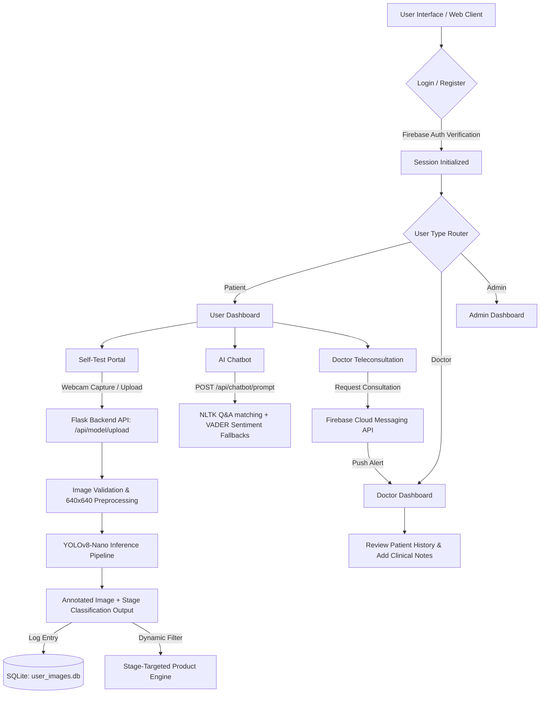
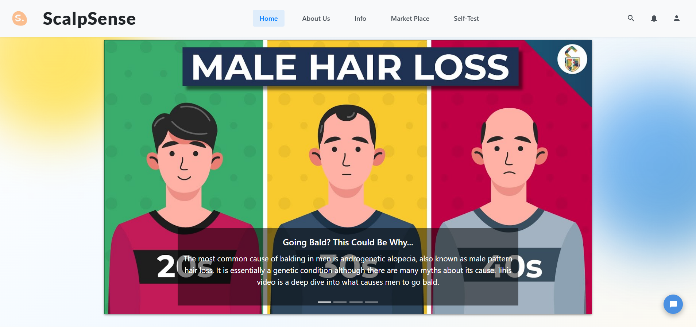
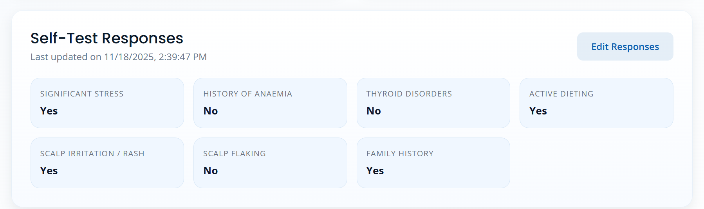
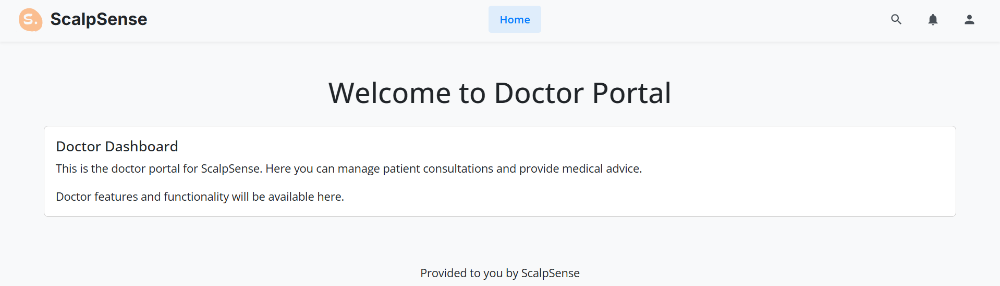
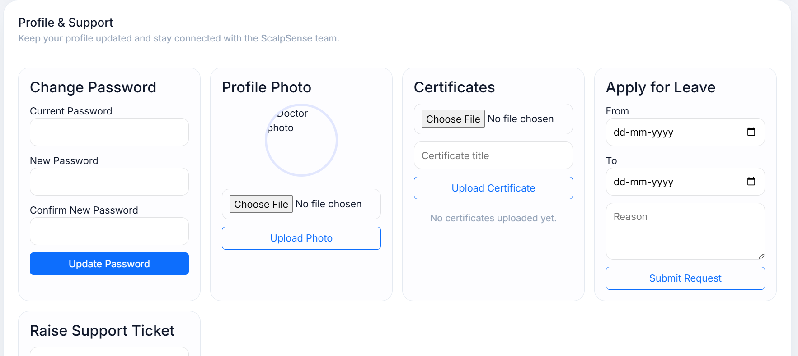
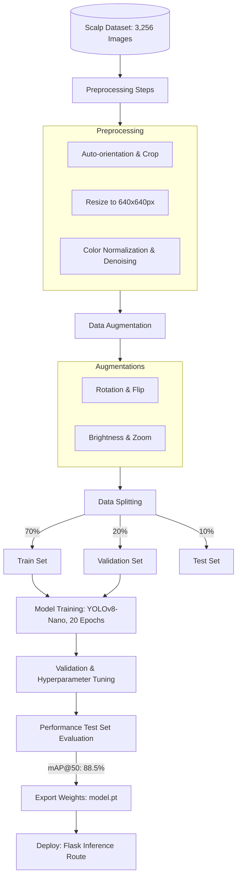

# ScalpSense: AI-Powered Scalp Health Diagnostics & Teleconsultation Platform

[](https://www.python.org/)
[](https://flask.palletsprojects.com/)
[](https://pytorch.org/)
[](https://www.nltk.org/)
[](https://sqlite.org/)
[](https://firebase.google.com/)
[](https://opensource.org/licenses/MIT)

**ScalpSense** is an end-to-end, multi-tenant web and mobile platform designed to bridge the gap between automated scalp health assessment and professional dermatological care. By combining custom computer vision (YOLO) with sentiment-aware conversational AI, ScalpSense enables users to perform instant, non-invasive scalp diagnostics, track hair health progression, explore curated marketplaces, and consult verified doctors in real time.

---

## Overview

### The Problem
Androgenetic Alopecia (pattern baldness) affects millions of individuals globally. While early detection is critical to stopping or reversing hair thinning, clinical consultations are frequently delayed by high costs, lack of accessibility, and the social anxiety associated with hair loss. Furthermore, users often struggle to find validated treatments among a crowded commercial marketplace.

### The Solution
ScalpSense delivers an accessible, private, and clinically relevant digital healthcare environment. The platform offers:
1. **Automated Computer Vision Screening**: Instant classification of hair loss severity using a custom-trained object detection model.
2. **Conversational Support**: An intelligent chatbot that addresses user queries, calibrated with sentiment analysis to detect anxiety and escalate to professionals.
3. **Teleconsultation Loop**: Dynamic routing connecting users directly to specialized doctors, supported by push notifications.
4. **Targeted E-Commerce**: An integrated marketplace serving products specifically filtered based on the user's diagnostic stage.

---

## Key Features

- 🔬 **Computer Vision Diagnostics (YOLOv8-Nano)**: Upload or capture scalp images via web camera to receive real-time stage classification (Normal, Stages 1–3, Bald) complete with annotated bounding boxes.
- 💬 **Sentiment-Aware Chatbot**: Custom conversational assistant using keyword/intent classification and NLTK VADER Sentiment Intensity Analyzer. It gauges user anxiety in real time, shifting fallback responses toward professional consultations.
- 🏥 **Multi-Tenant Architecture**: Dedicated layouts and customized dashboards for **Patients**, **Doctors** (to review diagnostic histories and manage patient reports), and **Administrators** (to manage product inventory and platform settings).
- 🛍️ **Smart Marketplace**: Product recommendation engine that aligns therapeutic shampoo, oils, and treatments with the user's identified hair-loss stage.
- 🔔 **FCM Notification Routing**: Integrates Firebase Cloud Messaging (FCM) to trigger instant alerts, notifying doctors of new consultations or patients of medical feedback.

---

## System Workflow

The following flowchart illustrates the user journey, API transitions, and background machine learning pipelines:



---

## Architecture

ScalpSense is designed on a decoupled, modular Flask blueprint architecture. The backend aggregates core routing and business logic while exposing REST APIs consumed by both the web frontend and mobile client.

```
┌────────────────────────────────────────────────────────┐
│                      Web/Mobile Client                 │
└───────────────────────────┬────────────────────────────┘
                            │ (JSON / Multipart Form)
                            ▼
┌────────────────────────────────────────────────────────┐
│                   Flask Backend (WSGI)                 │
│  ┌──────────────────────────────────────────────────┐  │
│  │                     Blueprints                   │  │
│  │   User Routes    Doctor Routes    Admin Routes   │  │
│  └────────────────────────┬─────────────────────────┘  │
│                           │                            │
│                           ▼                            │
│  ┌──────────────────────────────────────────────────┐  │
│  │                    API Gateway                   │  │
│  │   - Security Middleware (API Key Gating)         │  │
│  │   - CORS Headers Enforcement                     │  │
│  └───────┬─────────────────┬─────────────────┬──────┘  │
└──────────┼─────────────────┼─────────────────┼─────────┘
           │                 │                 │
           ▼                 ▼                 ▼
┌──────────────────┐ ┌───────────────┐ ┌───────────────┐
│  PyTorch Models  │ │ Firebase SDK  │ │  SQLite DBs   │
│  - YOLOv8-Nano   │ │ - Firestore   │ │ - database.db │
│  - NLTK VADER    │ │ - Messaging   │ │ - user_images │
└──────────────────┘ └───────────────┘ └───────────────┘
```

### Database Specifications
The system utilizes two isolated SQLite relational databases to separate transactional product data from personal diagnostic histories, ensuring data isolation and easy scaling:
- **`database.db`**: Stores product details (ID, Name, Price, Brand, Stage Category, URL, Benefits) for the marketplace.
- **`user_images.db`**: Stores patient scanning logs (ID, User ID, Base64 Image, Scan Timestamp, Predicted Stage).

### Security Gating
A unified API-key validation middleware (`api_bp.before_request`) inspects the query parameters of incoming requests. It enforces authorization for model and database queries by matching requests against configuration variables:
- `WEB_API_KEY`: Gates internal requests from the web frontend blueprints.
- `MOBILE_API_KEY`: Gates external requests generated by the Flutter mobile application.

---

## Tech Stack

- **Frontend**: HTML5, Vanilla JavaScript (ES6+), CSS3
- **Backend**: Python 3.10, Flask 3.0, Gunicorn (POSIX) / Waitress (Windows WSGI)
- **Database**: SQLite3, Google Cloud Firestore (FCM Token and metadata storage)
- **ML/AI**: PyTorch, Ultralytics YOLOv8 (Image Inference), NLTK VADER (Sentiment Analysis)
- **Cloud & Communications**: Firebase Cloud Messaging (FCM), Firebase Admin SDK
- **Environment**: Dotenv, Virtualenv, PIP

---

## Screenshots

### Application Screenshots

#### 1. User Dashboard & Core Educational Banner
*The primary patient dashboard showing the navigation bar (Home, About Us, Info, Market Place, Self-Test) and a prominent education carousel on male pattern baldness.*


#### 2. Self-Test Questionnaire & Responses Panel
*Summarized answers to risk assessment factors (e.g., stress indicators, diet, family history) completed during the self-test.*


#### 3. Doctor Portal
*The welcome workspace landing page for verified medical professionals consulting on the platform.*


#### 4. Doctor Profile & Credentials Setup
*Account console letting doctors upload credentials/certificates, submit leave requests, and customize details.*


---

## Project Structure

```
ScalpSense/
│
├── app/
│   ├── api/                          # Core REST API Blueprints
│   │   ├── database/                 # SQLite Database access wrappers
│   │   │   ├── images/routes.py      # Historical scan retrieval endpoints
│   │   │   └── products/routes.py    # Marketplace CRUD endpoints
│   │   ├── environment/routes.py     # Session and configuration helpers
│   │   ├── model/                    # Machine Learning Inference Engines
│   │   │   ├── chatbot/              # Intent & similarity-matching chat
│   │   │   ├── image_model/          # PyTorch YOLOv8-Nano prediction script
│   │   │   └── tf_chatbot/           # NLTK VADER Sentiment Analyzer
│   │   ├── notifications/routes.py   # Firebase Cloud Messaging integrations
│   │   └── routes.py                 # API Key validator & router setup
│   │
│   ├── WebApp/                       # Traditional Web Pages Blueprints
│   │   ├── Admin/routes.py           # Administrative catalog controls
│   │   ├── Doctor/routes.py          # Physician portals & clinical workspaces
│   │   ├── User/routes.py            # About Us and User-routing panels
│   │   └── routes.py                 # Authentication flow & session management
│   │
│   ├── database/                     # SQLite Database assets (.db files)
│   ├── static/                       # Static stylesheets, scripts, and logos
│   │   ├── css/
│   │   ├── js/
│   │   └── img/
│   ├── templates/                    # Jinja2 HTML templates
│   ├── uploads/                      # Temporary storage for diagnostic processing
│   ├── __init__.py                   # App Factory configuration & Session setup
│   └── routes.py                     # Main redirect logic & app links
│
├── docs/                             # Documentation assets
│   └── images/                       # UI Screenshots and Architecture diagrams
│
├── .env.example                      # Configuration environment template
├── requirements.txt                  # Python dependencies
├── wsgi.py                           # Application WSGI entry point
└── .gitignore                        # Git ignore file (cache, database, keys)
```

---

## Installation

### Prerequisites
- Python 3.10 or higher
- Pip (Python Package Installer)
- Git

### Step-by-Step Setup

1. **Clone the Repository**
   ```bash
   git clone https://github.com/yourusername/ScalpSense.git
   cd ScalpSense
   ```

2. **Initialize a Virtual Environment**
   ```powershell
   # Windows
   python -m venv venv
   .\venv\Scripts\activate
   
   # Linux/macOS
   python3 -m venv venv
   source venv/bin/activate
   ```

3. **Install Dependencies**
   ```bash
   pip install -r requirements.txt
   ```

4. **Configure Environment Variables**
   Copy the example environment configuration and populate the values:
   ```bash
   cp .env.example .env
   ```
   Open the newly created `.env` file and configure:
   - `SECRET_KEY`: A secure string for encrypting Flask session data.
   - `WEB_API_KEY` and `MOBILE_API_KEY`: API keys used by the client apps.
   - Firebase credentials parameters (`FB_APIKEY`, `FIREBASE_CRED_PATH`, `FCM_SERVER_KEY`).

---

## Usage

### Running Locally (Development Mode)
Run the application locally using the WSGI entry file:
```bash
python wsgi.py
```
By default, the server will start on `http://127.0.0.1:5000/`. Set `ENVIRONMENT=True` in `.env` to enable live debugging.

### Production Deployment (WSGI Servers)
Gunicorn or Waitress should be used to spin up concurrent workers for staging and production.

- **Waitress (Windows)**:
  ```powershell
  waitress-serve --listen=127.0.0.1:5000 wsgi:app
  ```
- **Gunicorn (Linux/macOS)**:
  ```bash
  gunicorn -w 4 -b 127.0.0.1:5000 wsgi:app
  ```

---

## API Documentation

All API requests must supply a valid `api_key` query parameter matching either the `WEB_API_KEY` or `MOBILE_API_KEY`.

### 1. Model & Diagnostics
* **Upload Image** (`POST /api/model/upload?api_key=<KEY>&user_id=<USER_ID>`)
  * **Payload**: `multipart/form-data` containing the image file under the key `image`.
  * **Response**: `{"message": "File uploaded successfully", "filename": "<user_id>.png"}`
* **Predict Stage** (`GET /api/model/predict?api_key=<KEY>&user_id=<USER_ID>`)
  * **Action**: Invokes YOLOv8-Nano, runs inference on the uploaded image, annotates it, and logs the result.
  * **Response**: `{"stage": "stage 2", "file": "<Base64 Encoded Image Data>"}`

### 2. Conversational Agent
* **Chatbot Prompt** (`POST /api/chatbot/prompt?api_key=<KEY>`)
  * **Payload**: `{"prompt": "my hair is falling out what should I do?"}`
  * **Response**: `{"response": "Based on your queries, I recommend checking..."}`
* **Sentiment Analysis** (`POST /api/techfiesta/prompt?api_key=<KEY>`)
  * **Payload**: `{"sentence": "I feel extremely anxious about my baldness"}`
  * **Response**: `{"score": {"neg": 0.53, "neu": 0.47, "pos": 0.0, "compound": -0.52}}`

### 3. Database & Products
* **Get All Products** (`GET /api/database/products?api_key=<KEY>`)
  * **Response**: JSON array containing all catalog products.
* **Get Specific Product** (`GET /api/database/product/<id>?api_key=<KEY>`)
  * **Response**: Details of the product matching the ID parameter.

### 4. Push Alerts
* **Send Scan Reminders** (`GET /api/notification/send?api_key=<KEY>`)
  * **Action**: Queries Firestore for active user device tokens and pushes standard notification payloads via FCM.
  * **Response**: `{"tokens": ["token1", "token2", ...]}`

---

## Model Details

### Model Architecture: YOLOv8-Nano
The image classification pipeline leverages **YOLOv8-Nano (YOLOv8n)**. Designed for low latency, YOLOv8-Nano balances high speed with local model execution, containing **225 layers, 3.01 million parameters, and 8.2 GFLOPs**. This lightweight parameter size is ideal for CPU-bound edge deployment or quick microservices.



### Dataset and Preprocessing
The model was trained on a custom-curated collection of **3,256 high-resolution scalp images** sourced from dermatological databases and verified contributions:
- **Classes**: Normal, Stage 1, Stage 2, Stage 3, and Bald (representing androgenetic alopecia progression).
- **Preprocessing Pipeline**:
  - Image resizing to unified $640 \times 640$ pixels.
  - Color, brightness, and orientation normalization.
- **Augmentation Techniques**: Applied rotation, vertical/horizontal flipping, zoom, and brightness adjustments to ensure model generalization across varying lighting and demographic qualities.
- **Split**: 70% Training, 20% Validation, 10% Testing.
- **Training Duration**: 20 epochs using PyTorch.

---

## Performance Metrics

| Metric | Value | Detail |
| :--- | :--- | :--- |
| **mAP@50** | **88.5%** | Mean Average Precision showing strong object localization stability. |
| **Precision** | **90.0%** | Minimal false positive classification rate. |
| **Recall** | **87.0%** | Low false negative rate for hair thinning identification. |
| **Inference Latency** | **1.6 seconds** | Measured on standard CPU environment (includes PyTorch load, preprocessing, prediction, and DB logging). |

---

## Future Enhancements

1. **Transformer LLM Chatbot Integration**: Replace the intent/similarity matching logic with a lightweight local LLM to handle unstructured user inquiries with higher flexibility.
2. **Relational Database Migration**: Upgrade from SQLite3 to PostgreSQL to support concurrent connection pooling and transaction locking as patient-doctor consult volumes scale.
3. **WebRTC Consultation Rooms**: Incorporate video conferencing within the Doctor-User consultation blueprint to allow direct face-to-face follow-ups.
4. **App Store Release**: Complete validation of the Flutter client and compile build packages for iOS and Android deployment.

---

## License

Distributed under the MIT License. See [LICENSE](LICENSE) for more information.
